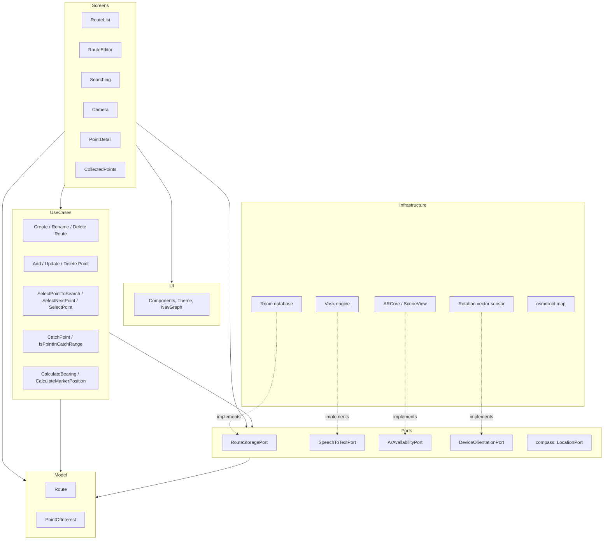
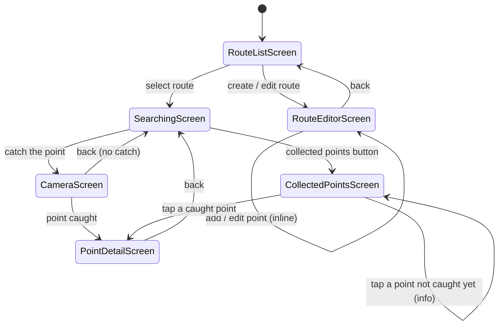
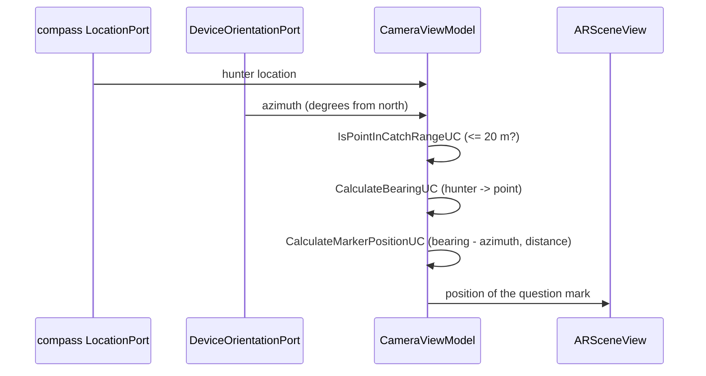

# Mystery Hunters (Łowcy Tajemnic)

[](https://www.gnu.org/licenses/gpl-3.0.html)

An Android mystery hunting game. 
A hunter picks a route, follows a compass to the next mistery, and when close enough uncovers a three dimensional question mark through the camera. 
Every point carries a description that is revealed once the point has been caught.

## Features

- **Routes** stored in a local Room database, created and renamed by the hunter.
- **Points of interest** placed by tapping an OpenStreetMap map. Each point has a user visible id,
  assigned automatically and sequentially from 1 within its route, and immutable afterwards.
- **Descriptions dictated offline.** Speech to text runs entirely on the device through Vosk, with a
  Polish and an English model. Nothing is sent to a network service and no audio is stored. When the
  engine or the model is unavailable, or the hunter does not like the result, the text field is
  always there to fall back to.
- **Compass navigation** showing direction and distance in steps to the current mystery, delivered by
  the `compass` module.
- **Augmented reality catching.** Within 20 m of a point a three dimensional question mark appears in
  the camera picture; beyond that range the screen says there is nothing to catch.
- **Works without ARCore.** On devices that have no ARCore the camera screen falls back to a plain
  preview with a flat question mark, so no phone loses the ability to play.
- **Progress tracking** with a collected points list, automatic switching to the next point that is
  still missing, and congratulations when a route is finished.
- **Polish and English**, Polish being the default.

## Architecture

The project follows Uncle Bob's Clean Architecture, with the same layering as the reference project.
It is a single module Android application written in Kotlin with Jetpack Compose.



The dependency rules are:

- **Model** — pure Kotlin data structures, depending on nothing at all, not even Android.
- **Use cases** — one action or business rule each, depending only on the model and on port APIs.
- **Ports** — interfaces wrapping every external dependency, which is what makes them mockable.
- **Screens** — the top of the tree, free to depend on anything. Each screen is split into a
  Composable, a state and a ViewModel; the Composable works off the state and only the ViewModel
  knows about use cases and ports.

### Package layout

| Package | Holds |
|---------|-------|
| `model` | `Route`, `PointOfInterest` |
| `usecase` | one class per action, e.g. `CatchPointUC`, `AddPointOfInterestUC` |
| `port` | port interfaces, with their implementations in `port/storage`, `port/speech`, `port/ar`, `port/orientation` |
| `screen` | one package per screen, each with a Screen, a State and a ViewModel |
| `ui` | theme, reusable components, navigation graph, screen relative sizing |
| `di` | Hilt modules: `PortsModule` (replaced in instrumented tests) and `SingletonModule` |

### Screen flow



### How the question mark is placed

ARCore does not align its world with north, and the Geospatial API that would solve that needs a
Google Cloud project and a network connection. The app deliberately stays keyless and offline, so
the marker is positioned relative to the camera instead:



Both calculations are plain use cases with no Android dependency, so they are covered by ordinary unit tests. 
`ARSceneView` is left at its default `GeospatialMode.DISABLED`, so no API key and no network connection are involved.

What this costs: the mark is only as accurate as the phone's magnetometer and GPS. 
Near metal or indoors the compass drifts and the mark drifts with it, and it is positioned relative to the phone rather than pinned to the world, so it does not stay put when the hunter walks around it. 
For a 20 m catch radius that is good enough, and it keeps the game working offline. 
If you want the mark truly anchored to its place on Earth, see [Optional: the ARCore Geospatial API](#optional-the-arcore-geospatial-api).

## Tech stack

| Component | Version |
|-----------|---------|
| Kotlin | 2.4.20 |
| Android Gradle Plugin | 9.4.0 |
| Gradle | 9.6.0 |
| compileSdk / targetSdk | 36 |
| minSdk | 26 (Android 8.0, the practical baseline for ARCore) |
| Compose BOM | 2026.06.01 |
| Hilt | 2.60.1 |
| Room | 2.8.5 |
| compass (GitHub Packages) | 0.0.2 |
| Map | osmdroid 6.1.20 (OpenStreetMap, no access token) |
| Augmented reality | io.github.sceneview:arsceneview 4.34.0 |
| Speech to text | Vosk 0.3.75, offline |
| Tests | JUnit 5.14.4, AssertJ 3.27.3, test-arranger 1.7.2 |

The library versions are the newest ones that still build against `compileSdk 36`. 
Anything newer (Compose BOM 2026.08.00 and later, navigation 2.10, arsceneview 4.35) demands `compileSdk 37`.

## Setup

### 1. Android SDK

Android Studio, or a command line SDK with platform 36 and build tools 36. 
`local.properties` has to point at it:

```properties
sdk.dir=/path/to/Android/Sdk
```

### 2. GitHub Packages credentials for the compass module

The `compass` artifact is published to GitHub Packages from the `maly-poszukiwacz-skarbow`
repository, and GitHub requires authentication even for public packages. Create a personal access
token with the `read:packages` scope and add it to `~/.gradle/gradle.properties`:

```properties
gpr.user=<your github login>
gpr.key=<the token>
```

`GITHUB_ACTOR` and `GITHUB_TOKEN` environment variables work as well, which is what the pipeline
uses. The artifact version is set by `COMPASS_VERSION` in `gradle.properties`.

### 3. Offline speech models (optional)

The Vosk models are around 95 MB together, too much for the repository, so they are fetched on
demand:

```bash
./gradlew downloadVoskModels
```

This unpacks `vosk-model-small-pl-0.22` and `vosk-model-small-en-us-0.15` into
`app/src/main/assets`, where `.gitignore` keeps them out of commits. Without them the app still
works, it just goes straight to the text field instead of offering the microphone.

### 4. Build

```bash
./gradlew assembleDebug
```

### 5. ARCore API key — not required

**The app needs no Google API key and no Google Cloud project.** It uses plain ARCore motion
tracking, which is free, offline and keyless. Nothing has to be configured for augmented reality to
work; on a device without ARCore the camera screen falls back by itself.

An API key only becomes necessary if you move the app onto the ARCore Geospatial API, described
below. That is an upgrade, not a missing piece.

#### Optional: the ARCore Geospatial API

The Geospatial API places anchors at real world coordinates using Google's Visual Positioning
System, instead of working the direction out from the phone's compass. The mark would then stay
exactly where it belongs while the hunter walks around it, and would not drift when the
magnetometer is disturbed. In exchange it needs a Google Cloud project, a network connection, and
VPS coverage at the place being hunted — where there is no coverage, and there is none in most of
the countryside, it cannot resolve a position at all. Keep the current placement as a fallback if
you take this on.

To configure it:

1. **Create a Google Cloud project** at https://console.cloud.google.com and enable the **ARCore
   API** (`arcore.googleapis.com`) under *APIs & Services → Library*. The API has a free tier and
   billing has to be enabled on the project.
2. **Create an API key** under *APIs & Services → Credentials → Create credentials → API key*.
   Restrict it: *Application restrictions → Android apps*, adding the package name
   `pl.marianjureczko.mysteryhunters` together with the SHA-1 of every signing certificate you use
   (debug and release are different), and *API restrictions → ARCore API*. An unrestricted key can
   be lifted out of the APK and spent by anyone.
3. **Keep the key out of the repository.** Put it in `~/.gradle/gradle.properties`:

   ```properties
   ARCORE_API_KEY=<the key>
   ```

   and inject it into the manifest from `app/build.gradle`, the way the reference project handles
   its tokens:

   ```groovy
   defaultConfig {
       manifestPlaceholders = [arcoreApiKey: findProperty('ARCORE_API_KEY') ?: '']
   }
   ```

   ```xml
   <meta-data
       android:name="com.google.android.ar.API_KEY"
       android:value="${arcoreApiKey}" />
   ```

   For CI the key belongs in the `GRADLE_PROPERTIES` secret that the pipeline already restores.
4. **Turn the mode on** in `ArQuestionMark.kt`:

   ```kotlin
   ARSceneView(
       geospatialMode = Config.GeospatialMode.ENABLED,
       
   )
   ```
5. **Anchor the mark to the Earth** instead of positioning it relative to the camera. Points of
   interest store latitude and longitude but no altitude, so a terrain anchor is the one to use:
   once `Earth.trackingState` is `TRACKING`, call
   `Earth.resolveAnchorOnTerrainAsync(latitude, longitude, altitudeAboveTerrain, qx, qy, qz, qw,
   callback)`; it reports the anchor and a `TerrainAnchorState` through the callback, and that
   anchor goes into an `AnchorNode`. `CalculateBearingUC`,
   `CalculateMarkerPositionUC` and `DeviceOrientationPort` are then no longer needed for placement.

`IsPointInCatchRangeUC` is untouched by all of this: whether a point may be caught is decided from
the GPS distance, not from what the camera renders.

## Testing

### Unit tests

JUnit 5 with AssertJ and test-arranger, following
[the test-arranger Android guidelines](https://github.com/ocadotechnology/test-arranger/blob/master/ai/android/claude_tester_SKILL.md).
Every use case and the domain model are covered.

```bash
./gradlew testDebugUnitTest
```

Test data comes from `some<T>()` and `someObjects<T>(n)`; domain invariants (point ids running from 1
within a route, coordinates that exist on Earth) are encoded in custom arrangers under
`src/testShared`. Android cannot discover those arrangers reliably by reflection, so each one has to
be listed in `src/testShared/resources/arranger.properties`. The `checkArrangers` task enforces it
and runs before the tests:

```bash
./gradlew checkArrangers
```

### Instrumented tests

The happy paths run against an emulator. Every port is replaced by a test double through
`TestPortsModule`, so there is no database, GPS, microphone or ARCore involved.

```bash
./gradlew connectedDebugAndroidTest
```

An emulator to run them on, if there is none yet:

```bash
sdkmanager "system-images;android-36;google_apis;x86_64"
avdmanager create avd -n mystery_hunters -k "system-images;android-36;google_apis;x86_64" -d pixel_6
emulator -avd mystery_hunters
```

Two details are worth knowing when adding tests here. `ARSceneView` renders frame after frame, so
Compose never reports itself idle and synchronised assertions time out; the camera tests take the
Compose clock over and advance it by hand. And osmdroid only confirms a single tap after the double
tap window has passed, so a test that taps the map has to wait for the state to change rather than
assume the tap was handled at once.

Covered: creating a route, adding a point from the map, editing a point, falling back to text input
when speech recognition is unavailable, navigating to the first point on the first open, restoring
the last navigated point, changing the current point, catching a point, catching without ARCore,
the "too far" message, switching to the next point that is still missing, the congratulations
message, reading a caught point's description and the "not caught yet" information.

## Continuous integration

`.github/workflows/test_app.yml` runs the unit tests on every push to any branch. It restores
`gradle.properties` from the `GRADLE_PROPERTIES` secret, which is where the GitHub Packages
credentials come from.

## Notes on the specification

Decisions taken while building this, worth knowing before changing anything:

- **The compass module lives on a branch.** `pl.marianjureczko.poszukiwacz:compass` is built from the
  `module_compass` branch of `maly-poszukiwacz-skarbow`, not from `master`, and is published by the
  `compass-v*` tags. `0.0.2` is the newest published version.
- **SceneView instead of Sceneform.** The specification names the arcore-sceneform community fork.
  `io.github.sceneview:arsceneview` is its maintained successor by the same author, and unlike the
  original (last released in 2022, built against Kotlin 1.6 and targetSdk 31) it works with the
  current toolchain.
- **Library versions are the newest that still build against compileSdk 36.** The specification
  pins compileSdk and targetSdk at 36, and current AndroidX requires 37, so Compose BOM, navigation,
  lifecycle, core-ktx, hilt-navigation-compose and arsceneview are each one release behind the
  newest. Raising compileSdk to 37 would allow all of them to move up.
- **Augmented reality needs no API key.** Plain ARCore motion tracking is keyless and offline. The
  mark's position is worked out from the hunter's GPS and the phone's compass rather than from the
  Geospatial API, which would have required a Google Cloud project, a network connection and VPS
  coverage. Setup step 5 describes how to switch if that trade is ever worth making.
- **No ARCore means no lost feature.** The specification asks for a fallback but does not say what
  it should be; the camera screen shows a plain preview with a flat question mark, so catching works
  the same way on every device.
- **Points can be removed.** The specification only mentions creating and editing them, but an
  editor without a delete leaves a mistapped location on the route for good.
- **Point ids continue after the highest ever used**, matching the reference project. Removing a
  point from the middle never renumbers the others, which matters because the ids are shown to the
  user and are immutable.

## Licence

This project is licensed under the [GNU General Public License v3.0 or later](LICENSE)
(GPL-3.0-or-later, `SPDX-License-Identifier: GPL-3.0-or-later`), as the reference project
[maly-poszukiwacz-skarbow](https://github.com/mjureczko/maly-poszukiwacz-skarbow).

Copyright (C) 2026 Marian Jureczko

This program is free software: you can redistribute it and/or modify it under the terms of the GNU
General Public License as published by the Free Software Foundation, either version 3 of the
License, or (at your option) any later version.

This program is distributed in the hope that it will be useful, but WITHOUT ANY WARRANTY; without
even the implied warranty of MERCHANTABILITY or FITNESS FOR A PARTICULAR PURPOSE. See the GNU
General Public License for more details.

You should have received a copy of the GNU General Public License along with this program. If not,
see <https://www.gnu.org/licenses/>.
