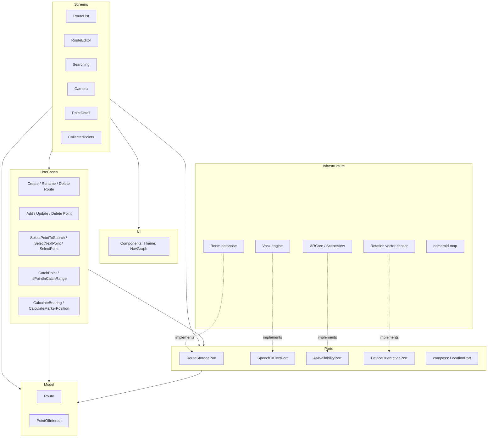
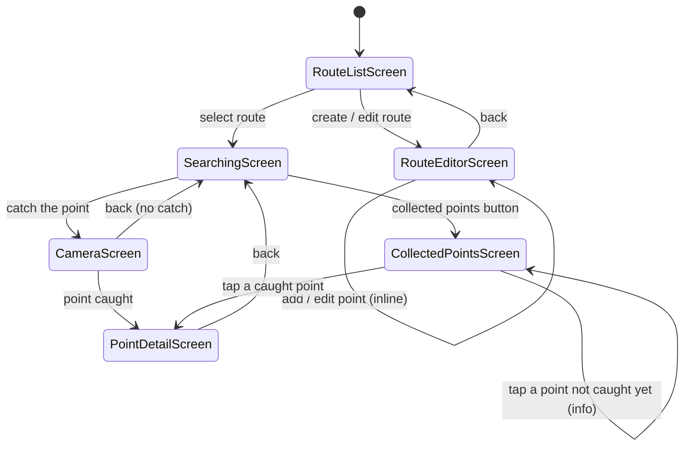
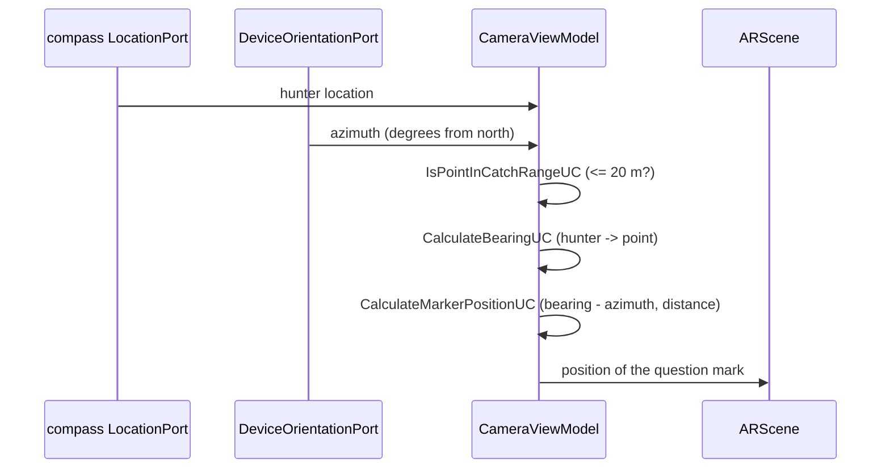

# Mystery Hunters (Łowcy Tajemnic)

An Android treasure hunting game. A hunter picks a route, follows a compass to the next point of
interest, and when close enough uncovers a three dimensional question mark through the camera. Every
point carries a description that is revealed once the point has been caught.

The app is the successor of [maly-poszukiwacz-skarbow](https://github.com/mjureczko/maly-poszukiwacz-skarbow)
and reuses its `compass` module, consumed as a published artifact rather than as source.

## Features

- **Routes** stored in a local Room database, created and renamed by the hunter.
- **Points of interest** placed by tapping an OpenStreetMap map. Each point has a user visible id,
  assigned automatically and sequentially from 1 within its route, and immutable afterwards.
- **Descriptions dictated offline.** Speech to text runs entirely on the device through Vosk, with a
  Polish and an English model. Nothing is sent to a network service and no audio is stored. When the
  engine or the model is unavailable, or the hunter does not like the result, the text field is
  always there to fall back to.
- **Compass navigation** showing direction and distance in steps to the current point, delivered by
  the `compass` module.
- **Augmented reality catching.** Within 20 m of a point a three dimensional question mark appears in
  the camera picture; beyond that range the screen says there is nothing to catch.
- **Works without ARCore.** On devices that have no ARCore the camera screen falls back to a plain
  preview with a flat question mark, so no phone loses the ability to play.
- **Progress tracking** with a collected points list, automatic switching to the next point that is
  still missing, and congratulations when a route is finished.
- **Polish and English**, Polish being the default.

## Architecture

The project follows Uncle Bob's Clean Architecture, with the same layering as the reference project.
It is a single module Android application written in Kotlin with Jetpack Compose.



The dependency rules are:

- **Model** — pure Kotlin data structures, depending on nothing at all, not even Android.
- **Use cases** — one action or business rule each, depending only on the model and on port APIs.
- **Ports** — interfaces wrapping every external dependency, which is what makes them mockable.
- **Screens** — the top of the tree, free to depend on anything. Each screen is split into a
  Composable, a state and a ViewModel; the Composable works off the state and only the ViewModel
  knows about use cases and ports.

### Package layout

| Package | Holds |
|---------|-------|
| `model` | `Route`, `PointOfInterest` |
| `usecase` | one class per action, e.g. `CatchPointUC`, `AddPointOfInterestUC` |
| `port` | port interfaces, with their implementations in `port/storage`, `port/speech`, `port/ar`, `port/orientation` |
| `screen` | one package per screen, each with a Screen, a State and a ViewModel |
| `ui` | theme, reusable components, navigation graph, screen relative sizing |
| `di` | Hilt modules: `PortsModule` (replaced in instrumented tests) and `SingletonModule` |

### Screen flow



### How the question mark is placed

ARCore does not align its world with north and the Geospatial API would require a Google Cloud key,
which the project deliberately avoids. Instead the marker is positioned relative to the camera:



Both calculations are plain use cases with no Android dependency, so they are covered by ordinary
unit tests.

## Tech stack

| Component | Version |
|-----------|---------|
| Kotlin | 2.4.20 |
| Android Gradle Plugin | 9.4.0 |
| Gradle | 9.6.0 |
| compileSdk / targetSdk | 36 |
| minSdk | 26 (Android 8.0, the practical baseline for ARCore) |
| Compose BOM | 2026.06.01 |
| Hilt | 2.60.1 |
| Room | 2.8.5 |
| compass (GitHub Packages) | 0.0.2 |
| Map | osmdroid 6.1.20 (OpenStreetMap, no access token) |
| Augmented reality | io.github.sceneview:arsceneview 4.34.0 |
| Speech to text | Vosk 0.3.75, offline |
| Tests | JUnit 5.14.4, AssertJ 3.27.3, test-arranger 1.7.2 |

The library versions are the newest ones that still build against `compileSdk 36`. Anything newer
(Compose BOM 2026.08.00 and later, navigation 2.10, arsceneview 4.35) demands `compileSdk 37`.

## Setup

### 1. Android SDK

Android Studio, or a command line SDK with platform 36 and build tools 36. `local.properties` has to
point at it:

```properties
sdk.dir=/path/to/Android/Sdk
```

### 2. GitHub Packages credentials for the compass module

The `compass` artifact is published to GitHub Packages from the `maly-poszukiwacz-skarbow`
repository, and GitHub requires authentication even for public packages. Create a personal access
token with the `read:packages` scope and add it to `~/.gradle/gradle.properties`:

```properties
gpr.user=<your github login>
gpr.key=<the token>
```

`GITHUB_ACTOR` and `GITHUB_TOKEN` environment variables work as well, which is what the pipeline
uses. The artifact version is set by `COMPASS_VERSION` in `gradle.properties`.

### 3. Offline speech models (optional)

The Vosk models are around 95 MB together, too much for the repository, so they are fetched on
demand:

```bash
./gradlew downloadVoskModels
```

This unpacks `vosk-model-small-pl-0.22` and `vosk-model-small-en-us-0.15` into
`app/src/main/assets`, where `.gitignore` keeps them out of commits. Without them the app still
works, it just goes straight to the text field instead of offering the microphone.

### 4. Build

```bash
./gradlew assembleDebug
```

## Testing

### Unit tests

JUnit 5 with AssertJ and test-arranger, following
[the test-arranger Android guidelines](https://github.com/ocadotechnology/test-arranger/blob/master/ai/android/claude_tester_SKILL.md).
Every use case and the domain model are covered.

```bash
./gradlew testDebugUnitTest
```

Test data comes from `some<T>()` and `someObjects<T>(n)`; domain invariants (point ids running from 1
within a route, coordinates that exist on Earth) are encoded in custom arrangers under
`src/testShared`. Android cannot discover those arrangers reliably by reflection, so each one has to
be listed in `src/testShared/resources/arranger.properties`. The `checkArrangers` task enforces it
and runs before the tests:

```bash
./gradlew checkArrangers
```

### Instrumented tests

The happy paths run against an emulator. Every port is replaced by a test double through
`TestPortsModule`, so there is no database, GPS, microphone or ARCore involved.

```bash
./gradlew connectedDebugAndroidTest
```

Covered: creating a route, adding a point from the map, editing a point, falling back to text input
when speech recognition is unavailable, navigating to the first point on the first open, restoring
the last navigated point, changing the current point, catching a point, catching without ARCore,
the "too far" message, switching to the next point that is still missing, the congratulations
message, reading a caught point's description and the "not caught yet" information.

## Continuous integration

`.github/workflows/test_app.yml` runs the unit tests on every push to any branch. It restores
`gradle.properties` from the `GRADLE_PROPERTIES` secret, which is where the GitHub Packages
credentials come from.

## Licence

GPLv3, as the reference project.
